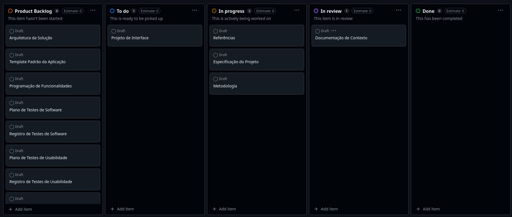

# Metodologia
## Gerenciamento do Projeto

A metodologia ágil escolhida para o desenvolvimento deste projeto foi o SCRUM, pois como citam Amaral, Fleury e Isoni (2019, p. 68), seus benefícios são a
“visão clara dos resultados a entregar; ritmo e disciplina necessários à execução; definição de papéis e responsabilidades dos membros do projeto (Scrum Owner, Scrum Master e Team); empoderamento dos membros da equipe de projetos para atingir o desafio; conhecimento distribuído e compartilhado de forma colaborativa; ambiente favorável para crítica às ideias e não às pessoas.”

Foram definidas reuniões três vezes por semana de curtas durações para alinhamento e discussões entre os membros da equipe. 

<!-- 
Pré-requisitos: <a href="2-Especificação do Projeto.md"> Documentação de Especificação</a>

Descreva aqui a metodologia de trabalho do grupo para atacar o problema. Definições sobre os ambiente de trabalho utilizados pela  equipe para desenvolver o projeto. Abrange a relação de ambientes utilizados, a estrutura para gestão do código fonte, além da definição do processo e ferramenta através dos quais a equipe se organiza (Gestão de Times).

## Relação de Ambientes de Trabalho

Os artefatos do projeto são desenvolvidos a partir de diversas plataformas e a relação dos ambientes com seu respectivo propósito deverá ser apresentada em uma tabela que especifica que detalha Ambiente, Plataforma e Link de Acesso. 
Nota: Vide documento modelo do estudo de caso "Portal de Notícias" e defina também os ambientes e frameworks que serão utilizados no desenvolvimento de aplicações móveis.

## Controle de Versão

A ferramenta de controle de versão adotada no projeto foi o
[Git](https://git-scm.com/), sendo que o [Github](https://github.com)
foi utilizado para hospedagem do repositório.

O projeto segue a seguinte convenção para o nome de branches:

- `main`: versão estável já testada do software
- `unstable`: versão já testada do software, porém instável
- `testing`: versão em testes do software
- `dev`: versão de desenvolvimento do software

Quanto à gerência de issues, o projeto adota a seguinte convenção para
etiquetas:

- `documentation`: melhorias ou acréscimos à documentação
- `bug`: uma funcionalidade encontra-se com problemas
- `enhancement`: uma funcionalidade precisa ser melhorada
- `feature`: uma nova funcionalidade precisa ser introduzida

Discuta como a configuração do projeto foi feita na ferramenta de versionamento escolhida. Exponha como a gerência de tags, merges, commits e branchs é realizada. Discuta como a gerência de issues foi realizada.

> **Links Úteis**:
> - [Microfundamento: Gerência de Configuração](https://pucminas.instructure.com/courses/87878/)
> - [Tutorial GitHub](https://guides.github.com/activities/hello-world/)
> - [Git e Github](https://www.youtube.com/playlist?list=PLHz_AreHm4dm7ZULPAmadvNhH6vk9oNZA)
>  - [Comparando fluxos de trabalho](https://www.atlassian.com/br/git/tutorials/comparing-workflows)
> - [Understanding the GitHub flow](https://guides.github.com/introduction/flow/)
> - [The gitflow workflow - in less than 5 mins](https://www.youtube.com/watch?v=1SXpE08hvGs)
-->

### Divisão de Papéis

 A equipe utiliza metodologias ágeis, tendo escolhido o Scrum como base para definição do processo de desenvolvimento. A equipe está organizada da seguinte maneira:
- Scrum Master: Davi Bicalho;
- Product Owner: Louise Dias;
- Equipe de Desenvolvimento: Igor Gomes, Kaio Rocha, Marcos Takamatsu, Davi Bicalho, Louise Dias;
- Equipe de Design: Andryws Pedro, Marcos Takamatsu.

### Processo

Para organização e distribuição das tarefas do projeto, a equipe está utilizando o GitHub, estruturado com as seguintes listas:

- Product Backlog: recebe as tarefas a serem trabalhadas e representa o Backlog do produto. Todas as atividades identificadas no decorrer do projeto estão incluídas nesta lista.
- To Do: esta lista representa o Sprint Backlog que está sendo trabalhado.
- Em andamento: lista das tarefas iniciadas.
- Feito: nesta lista são colocadas as tarefas finalizadas e as que passaram pelos testes e controle de qualidade, prontas para serem entregues aos usuários.
  
O quadro kanban do grupo no GitHub apresentado, no estado atual, na figura abaixo:

Figura 1 - Quadro Kanban do GitHub.

<!--
> **Links Úteis**:
> - [Planejamento e Gestáo Ágil de Projetos](https://pucminas.instructure.com/courses/87878/pages/unidade-2-tema-2-utilizacao-de-ferramentas-para-controle-de-versoes-de-software)
> - [Sobre quadros de projeto](https://docs.github.com/pt/issues/organizing-your-work-with-project-boards/managing-project-boards/about-project-boards)
> - [Project management, made simple](https://github.com/features/project-management/)
> - [Sobre quadros de projeto](https://docs.github.com/pt/github/managing-your-work-on-github/about-project-boards)
> - [Como criar Backlogs no Github](https://www.youtube.com/watch?v=RXEy6CFu9Hk)
> - [Tutorial Slack](https://slack.com/intl/en-br/)
-->

## Etiquetas
As tarefas são, ainda, etiquetadas em função da natureza da atividade e seguem o seguinte esquema de cores/categorias:

- Bug (Erro no código)
- Desenvolvimento (Development)
- Documentação (Documentation)
- Gerência de Projetos (Project Management)
- Infraestrutura (Infrastructure)
- Testes (Tests)

Figura 2 - Tela do esquema de cores e categorias

### Ferramentas

Os artefatos do projeto são desenvolvidos a partir de diversas plataformas e a relação dos ambientes com seu respectivo propósito é apresentada na tabela que se segue.

| AMBIENTE                            | PLATAFORMA                         | LINK DE ACESSO                         |
|-------------------------------------|------------------------------------|----------------------------------------|
| Documentos do projeto               | GitHub                             |https://github.com/ICEI-PUC-Minas-PMV-ADS/ads-2024-e1-proj-web-t9-rotulo-facil |
| Projeto de Interface 1                | Figma                              | https://www.figma.com/design/jXvNRbbO6cEgDtNFxk6BQX/Untitled?node-id=0-1&m=dev&t=vk7YpPLukqMeA7q0-1 |
| Projeto de Interface 2              | Figma                              | https://www.figma.com/design/jXvNRbbO6cEgDtNFxk6BQX/Projeto-ADS-Eixo-01?node-id=23-3&node-type=canvas&t=9gWOJM64A9LgBVjX-0 | 

- Editor de código: [Visual Studio Code](https://code.visualstudio.com/)
- Ferramentas de comunicação: [Teams](https://teams.microsoft.com/v2/?clientexperience=t2)
- Ferramentas de desenho de tela (_wireframing_)

O editor de código foi escolhido porque ele possui uma integração com o sistema de versão. As ferramentas de comunicação utilizadas possuem integração semelhante e por isso foram selecionadas. Por fim, para criar diagramas utilizamos essa ferramenta por melhor captar as necessidades da nossa solução.

Os artefatos do projeto são desenvolvidos a partir das plataformas GitHub e Figma.
 
> **Possíveis Ferramentas que auxiliarão no gerenciamento**:
> - [Figma](https://www.figma.com/design/jXvNRbbO6cEgDtNFxk6BQX/Untitled?node-id=0-1&m=dev&t=vk7YpPLukqMeA7q0-1)
> <!--- [Slack](https://slack.com/)-->
> - [Github](https://github.com/ICEI-PUC-Minas-PMV-ADS/ads-2024-e1-proj-web-t9-rotulo-facil.git)
